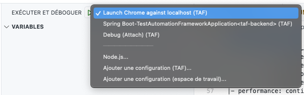
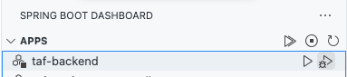

# Test Automation Framework - Developpement - Performance
Test Automation Framework (TAF) est un outil de gestions et d'exécution des plans de tests.

## Architecture Envisagée (Session Automne 2024)
Après analyse et discussion entre tous les membres de l'équipe, nous avons envisagée une architecture plus modulaire où chaque outil de test de performance est contenu dans son propre module Maven. Cela offre les avantages suivants:
- La maintenance de chaque module est **indépendante des autres modules de TAF** facilitant ainsi les tests, la livraison et le gestion des versions de chacun des modules.
- Le module **backend centralise les dépendances** afin d'offrir l'accès au différents outils de test de performance
- De nouveaux modules ou outils de performance peuvent être ajoutés facilement par la suite.
Voici le diagramme de l'architecture envisagée:


## Conseils pour la gestion du projet
Afin de mieux gérer le projet et collaborer efficacement entre les équipiers, nous avons utilisé [un projet dans Github](https://docs.github.com/en/issues/planning-and-tracking-with-projects/learning-about-projects/about-projects) avec une vue Kanban des tâches à compléter.

# Assurance Qualité
## Processus mis en place
1. **Tâche de programmation collaborative**  
   Afin de s'assurer de la qualité de notre code à livrer à l'équipe, nous avons décidé de créer un fork pour toute notre équipe à partir duquel chaque équipier à créer un fork.
   Ainsi, chacun doit créer un Pull Request vers le fork de l'équipe pour que le code soit vérifier avant la fusion dans la branche `develop`. Pour mieux comprendre la configuration, voici un diagramme ci dessous. De plus, Github a été intégré à une chaîne Discord pour s'assurer une réaction rapide des membres de l'équipe.
   
3. **Harmonisation des environnements de développement**  
   L'équipe utilise VSCode qui a la possibilité de recommender quelles extensions devraient installer pour faciliter le travail de développement. Par exemple, l'extension Spring Boot Dashboard permet de démarrer ou déboguer l'application backend avec facilité.
4. **Clean-as-you-code**  
   Selon les bonnes pratiques, nous utilisons l'**extension SonarLint** dans VSCode pour s'assurer de la lisibilité et de l'application de règle de style et de syntaxe. Ceci fonctionne à la fois pour Java et en Typescript (Angular).
5. **Tests unitaires**  
   Les composants JMeter, Gatling et la partie UI pour les tests de performance sont maintenant dotés de tests unitaires que chaque équipier peut exécuter avant de faire ses commits.
6. **Tests locaux des API**  
   Ajout de collections de tests pour l'outil de test d'API [Bruno](https://docs.usebruno.com/introduction/what-is-bruno). Ces tests peuvent être executé localement ou dans un environnement d'intégration continue comme Github Actions.
   Cela peut être utile dans le cas de tests après le déploiement sur un serveur.
7. **Intégration continue spéficique au projet 3**  
   Le [workflow Github Actions](/.github/workflows/build-test.yml) ont été réusinées pour permettre l'exécution des tests automatiques Junit et Karma dès qu'une Pull Request est créée ou modifiée. Cela permet d'effectuer des vérification sans supervision et avant que le code soit vérifier manuellement. 

## Intégration des changements vers l'équipe 1  
Malheureusement, le référentiel principal a changé de visibilité, ce qui a pour conséquence de briser le lien avec le fork de l'équipe. 
La solution est de copier manuellement le code (copier et coller du projet au complet). Le désavantage est que tout l'historique de nos commits sera perdu. La configuration Github actuelle ressemble à ceci:


## Déploiement dans un environnement infonuagique  
Malheureusement, l'équipe 1 n'a jamais mis d'environnement AWS à notre disposition pour tester nos composants. 

## Structure du code dans le project

```
Root
|- backend: contient le module
|- ...
|- frontend
   |- src/app
      |- _services/performance-test-api.service.ts: 
         contient les appels à l'API implémenté par le backend
      |- performance-test-api
         |- gatling-api: 
               contient les composants et pages pour le formulaire de test Gatling
               contient les fichiers de test unitaires de Gatling
         |- jmeter-api
               contient les composants et pages pour le formulaire de test JMeter
|- performance: contient le module Maven taf-performance
   |- gatling: contient le module Maven taf-performance-gatling, y compris les test unitaires
   |- jmeter: contient le module Maven taf-performance-jmeter, y compris les test unitaires

```
## (Re)démarrage du projet

### Pré-requis
- Afin de configurer son environnement de développement et d'avoir une expérience de développement productive, nous recommendons **[Visual Studio Code](https://code.visualstudio.com/docs)**. Le projet dans Github contient le dossier `.vscode` qui contient les fichiers de configuration pour VSCode. Nous avons ajouté des recommendations dans le fichier `extensions.json` pour installer les extensions qui vous sauverons beaucoup de temps pendant le développement.  
- D'autre part, une bonne connaissance de **[Springboot](https://spring.io/projects/spring-boot#learn)** et des **[composants Angular](https://angular.dev/guide/components)** devrait permettre d'être plus efficace.  
- Installer un Java Development Kit version 17  
  Nous avons utilisé le JDK de SAP: [SapMachine](https://sap.github.io/SapMachine/)
- Installer Apache Maven version 3.9 et plus  
> **NOTE**  
> Pour l'installation des outils Java, l'utilisation d'un package manager est recommandé pour l'insta. SDKMan pour MacOS/Linux et Chocolatey pour Windows

### Cloner le référentiel Github
Nous avons utilisé la branche `develop` du dépôt principal.
Cette branche est **protégée**. Tout changement dans cette branche requiert un Pull Request.
De plus, afin de garder notre dépôt Équipe 3 ci-dessus intacte, les équipiers doivent créer leur propre fork pour ensuite créer un pull request vers la branche `develop`.

### Démarrer le frontend
L'application Angular se trouve dans le dossier `frontend`.
Ouvrir une fenêtre de terminal dans VSCode et taper:
```
cd frontend
npm start
```
Ouvrir un navigateur et aller à l'addresse http://localhost:4200

**NOTE**  
Après avoir démarré l'application Angular, si vous voulez déboguer l'application Angular, il suffit d'utiliser la configuration de debug `Launch Chrome against localhost` dnas la vue Debugging de VSCode:


### Démarrer le backend
Pour s'assurer que le backend fonctionne correctement, ouvrir une fenêtre de terminal VSCode à la racine du projet et taper:
```
mvn clean install
```
Ensuite, vous pouvez démarrer l'application Springboot backend en utilisant l'extension VSCode **Sprint Boot Dashboard** (accessible via le bouton de la barre de gauche).

Les 2 boutons à droite permettent de démarrer l'application Sprintboot avec ou sans débogage.
